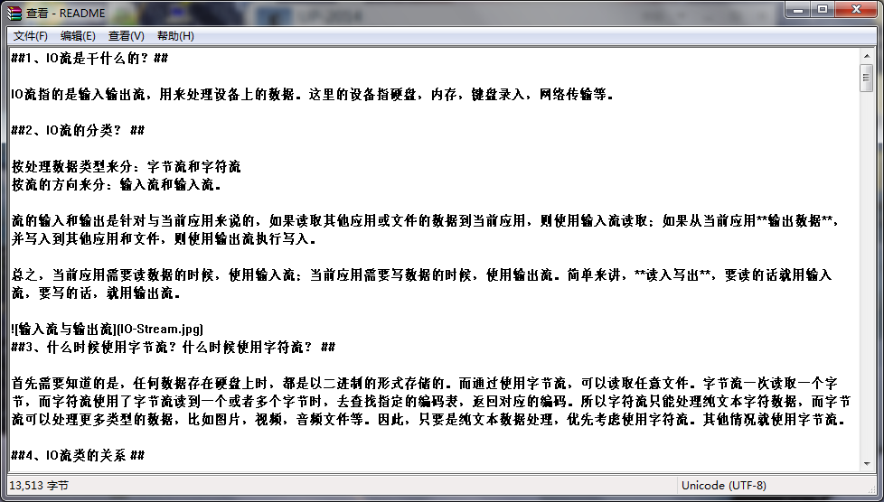

##1、IO流定义 ##

IO流指的是输入输出流，用来处理设备上的数据。这里的设备指硬盘，内存，键盘录入，网络传输等。

##2、IO流分类 ##

按处理数据类型来分：字节流和字符流  
按流的方向来分：输入流和输入流。

流的输入和输出是针对与当前应用来说的，如果读取其他应用或文件的数据到当前应用，则使用输入流读取；如果从当前应用**输出数据**，并写入到其他应用和文件，则使用输出流执行写入。

总之，当前应用需要读数据的时候，使用输入流；当前应用需要写数据的时候，使用输出流。简单来讲，**读入写出**，要读的话就用输入流，要写的话，就用输出流。

##3、字节流与字符流 ##

首先需要知道的是，任何数据存在硬盘上时，都是以二进制的形式存储的。而通过使用字节流，可以读取任意文件。字节流一次读取一个字节，而字符流使用了字节流读到一个或者多个字节时，去查找指定的编码表，返回对应的编码。所以字符流只能处理纯文本字符数据，而字节流可以处理更多类型的数据，比如图片，视频，音频文件等。因此，只要是纯文本数据处理，优先考虑使用字符流。其他情况就使用字节流。

##4、IO流类的关系 ##

##5、IO 包中的常见对象 ##

**1）字节流：**  

- 字节输入流  
> **FileInputStream(String name)**  
> Creates a FileInputStream by opening a connection to an actual file, the file named by the path name name in the file system.  
> **FileInputStream(File file)**  
> Creates a FileInputStream by opening a connection to an actual file, the file named by the File object file in the file system.  
> **BufferedInputStream(InputStream in)**  
> Creates a BufferedInputStream and saves its argument, the input stream in, for later use.  
> **BufferedInputStream(InputStream in, int size)**  
> Creates a BufferedInputStream with the specified buffer size, and saves its argument, the input stream in, for later use.  

- 字节输出流  
> **FileOutputStream(File file)**  
> Creates a file output stream to write to the file represented by the specified File object.  
> **FileOutputStream(String name)**  
> Creates a file output stream to write to the file with the specified name.  
> **BufferedOutputStream(OutputStream out)**  
> Creates a new buffered output stream to write data to the specified underlying output stream.  
> **BufferedOutputStream(OutputStream out, int size)**  
> Creates a new buffered output stream to write data to the specified underlying output stream with the specified buffer size.  

**2）字符流:**  

- 字符输入流  

> **FileReader(File file)**  
> Creates a new FileReader, given the File to read from.  
> **FileReader(String fileName)**  
> Creates a new FileReader, given the name of the file to read from.  
> **BufferedReader(Reader in)**  
> Creates a buffering character-input stream that uses a default-sized input buffer.  
> **BufferedReader(Reader in, int sz)**  
> Creates a buffering character-input stream that uses an input buffer of the specified size.  

- 字符输出流  

> **BufferedReader(Reader in)**  
> Creates a buffering character-input stream that uses a default-sized input buffer.  
> **BufferedReader(Reader in, int sz)**  
> Creates a buffering character-input stream that uses an input buffer of the specified size.  
> **BufferedWriter(Writer out)**  
> Creates a buffered character-output stream that uses a default-sized output buffer.  
> **BufferedWriter(Writer out, int sz)**  
> Creates a new buffered character-output stream that uses an output buffer of the given size.  
> 

**3）转换流:**  

> **InputStreamReader(InputStream in)**  
> Creates an InputStreamReader that uses the default charset.  
> **InputStreamReader(InputStream in, String charsetName)**  
> Creates an InputStreamReader that uses the named charset.
> **OutputStreamWriter(OutputStream out)**  
> Creates an OutputStreamWriter that uses the default character encoding.  
> **OutputStreamWriter(OutputStream out, String charsetName)**  
> Creates an OutputStreamWriter that uses the named charset.  

**4）文件对象:**  
> **File(File parent, String child)**  
> Creates a new File instance from a parent abstract pathname and a child pathname string.  
> **File(String pathname)**  
> Creates a new File instance by converting the given pathname string into an abstract pathname.  
> **File(String parent, String child)**  
> Creates a new File instance from a parent pathname string and a child pathname string.  

**5）打印流：**  

> **PrintWriter(File file)**  
> Creates a new PrintWriter, without automatic line flushing, with the specified file.  
> **PrintWriter(OutputStream out)**  
> Creates a new PrintWriter, without automatic line flushing, from an existing OutputStream.  
> **PrintStream(OutputStream out)**  
> Creates a new print stream.  
> **PrintStream(File file)**  
> Creates a new print stream, without automatic line flushing, with the specified file.  

## 6、字节流 ##
 1）使用InputStream读取文件得到字节数组，并利用new String(b,0,len,"UTF-8")将字节数组转换为字符串输出，详细请参考（JavaIODemo/src/com/andieguo/io/FileInputStreamDemo.java）。

	private static void read() {
		File src = new File("README.md");
		try {
			InputStream in = new FileInputStream(src);
			int len = 0;
			byte[] b = new byte[1024];
			StringBuffer buffer = new StringBuffer();
			while((len = in.read(b)) != -1){//区别于in.read();in.read(b)该方法是将读取到的字节填充到字节数组b中。
				//将字节数组转换为字符串;
				String str = new String(b,0,len,"UTF-8");//将字节数组转换为字符串默认使用GBK编码；如果所读取的文件使用的是非GBK编码，采用默认的GBK编码转换，则会出现乱码。
				buffer.append(str);
				System.out.println(buffer.toString());
			}
			in.close();
		} catch (Exception e) {
			e.printStackTrace();
		}
	}

 2）使用BufferedInputStream、BufferedOutputStream分别FileInputStream、FileOutputStream进行封装，实现对数据的读取与写入,详细请参考（JavaIODemo/src/com/andieguo/io/BufferedInputStreamDemo.java）。  

	private static void rename2() {
		File src = new File("IO.jpg");
		File dst = new File("IO_2.jpg");
		try {
			BufferedInputStream in = new BufferedInputStream(new FileInputStream(src));
			BufferedOutputStream out = new BufferedOutputStream(new FileOutputStream(dst));
			int len = 0;
			byte[] b = new byte[1024];
			while((len = in.read(b)) != -1){
				out.write(b,0,len);
			}
			out.close();
			in.close();
		} catch (Exception e) {
			e.printStackTrace();
		}
	}

## 7、字符流 ##

1）使用BufferedReader按字符流读取文件，文件编码与读取编码不一致时会出现乱码，详细请参考（JavaIODemo/src/com/andieguo/io/BufferReaderDemo.java）。

	@SuppressWarnings("unused")
	private static void read1() {
		File file = new File("README.md");//当Test.java使用UTF-8编码，而使用GBK编码进行读取的时候会出现乱码；
		try {
			BufferedReader in = new BufferedReader(new FileReader(file));//使用本地环境中的默认字符集，例如在中文环境中将使用 GBK编码
			String line = null;
			while((line = in.readLine()) != null){
				System.out.println(line);
			}
			in.close();
		} catch (Exception e) {
			e.printStackTrace();
		}
	}
	
2）InputStreamReader对字节和字符进行转换,指定使用“GBK”编码方式读取文件，详细请参考（JavaIODemo/src/com/andieguo/io/BufferReaderDemo.java）

	private static void read2() {
		File file = new File("README.md");//当Test.java使用UTF-8编码，而使用GBK编码进行读取的时候会出现乱码；
		try { 
			//为什么要对FileInputStream进行再一次封装，为了使用InputStreamReader对字节和字符进行转换；
			//为什么要对InputStreamReader进行再一次封装，为了使用BufferedReader的readline方法；
			BufferedReader in = new BufferedReader(new InputStreamReader(new FileInputStream(file),"UTF-8"));//使用本地环境中的默认字符集，例如在中文环境中将使用 GBK编码
			String line = null;
			while((line = in.readLine()) != null){
				System.out.println(line);
			}
			in.close();
		} catch (Exception e) {
			e.printStackTrace();
		}
	}

## 8、转换流 ##
InputStreamReader:字节到字符的桥梁（将读取的字节流转换为字符流）；  
OutputStreamWriter:字符到字节的桥梁（将输入的字符流抓换为字节流）；

**构造函数**
> **InputStreamReader(InputStream in)**  
> 使用默认的编码表GBK创建一个InputStreamReader
> 
> **InputStreamReader(InputStream in, String charsetName)**  
> 指定编码表创建一个InputStreamReader
> 
> **OutputStreamWriter(OutputStream out)**  
> 使用默认的编码表GBK创建一个OutputStreamWriter
> 
> **OutputStreamWriter(OutputStream out, String charsetName)**  
> 指定编码表创建一个OutputStreamWriter

使用OutputStreamWriter、InputStreamReader对D:\\Test.java文件分别使用使用GBK编码进行写、读，详细请参考（JavaIODemo/src/com/andieguo/io/OutputStreamWriterDemo.java）。

    public class OutputStreamWriterDemo {

		public static void main(String[] args){
			File file = new File("D:\\Test.java");
			try {
				// 写字符换转成字节流（使用GBK编码进行写）
				FileOutputStream outputStream = new FileOutputStream(file);
				OutputStreamWriter writer = new OutputStreamWriter(outputStream,"GBk");
				writer.write("我是中国人");
				writer.close();
				
				// 读取字节转换成字符（使用GBK编码进行读）
				FileInputStream inputStream = new FileInputStream(file);
				InputStreamReader reader = new InputStreamReader(inputStream,"GBk");
				StringBuffer buffer = new StringBuffer();
				char[] cbuf = new char[64];
				int count = 0;
				while((count = reader.read(cbuf))!=-1){
					buffer.append(cbuf,0,count);
					System.out.println(buffer);
				}
				reader.close();
	
			} catch (Exception e) {
				e.printStackTrace();
			} finally {
				
			}
			
		}
    }

## 9、数据流 ##

使用DataInputStream、DataOutputStream对DATA.txt文件进行基础类型数据的写入与读取，详细请参考（JavaIODemo/src/com/andieguo/io/DataInputStreamDemo.java）。

    public static void main(String[] args){
    		File src = new File("DATA.txt");
    		try{
    			DataInputStream in = new DataInputStream(new FileInputStream(src));
    			DataOutputStream out = new DataOutputStream(new FileOutputStream(src));
    			out.writeInt(100);//int型
    			out.writeDouble(999.9999);//double型
    			out.writeBoolean(true);//boolean型
    			out.writeUTF("HELLO,WORLD！");//UTF-8编码的字符串
    			System.out.println(in.readInt());
    			System.out.println(in.readDouble());
    			System.out.println(in.readBoolean());
    			System.out.println(in.readUTF());
    			out.flush();
    			out.close();
    			in.close();
    		}catch(Exception e){
    			e.printStackTrace();
    		}
    	}

## 10、对象流 ##

对象流ObjectInputStream，ObjectOutputStream把封装的对象直接输出，而不是一个个在转换成字符串再输出。本实例使用ObjectInputStream、ObjectOutputStream对Student.txt进行Student实体bean的读取、写入，详细请参考（JavaIODemo/src/com/andieguo/io/ObjectInputStreamDemo.java）。  
> **特别注意：**  
> 1）对象序列化：把对象直接转换成二进制，写入介质中；  
> 2）使用对象流需要实现Serializable接口，否则会报错。而若用transient关键字修饰成员变量，不写入该成员变量，若是引用类型的成员变量为null，值类型的成员变量为0。

	private static void readObject() {
		File src = new File("Student.txt");
		try{
			ObjectInputStream in = new ObjectInputStream(new FileInputStream(src));
			ObjectOutputStream out = new ObjectOutputStream(new FileOutputStream(src));
			Student student1 = new Student("andy", 24, true, "武汉", "7777777");
			Student student2 = new Student("posly", 24, true, "九江", "88888888");
			out.writeObject(student1);
			out.writeObject(student2);
			Object obj = null;
			while((obj = in.readObject())!=null){
				System.out.println(((Student)obj).toString());
			}
	        out.close();
	        in.close();
		}catch(Exception e){
			e.printStackTrace();
		}
	}

Console客户端输出结果：  

    Student [name=andy, age=24, sex=true, address=武汉, tel=7777777]  
    Student [name=posly, age=24, sex=true, address=九江, tel=88888888]  

## 11、流的加密与解密  ##

本实例通过GZIPOutputStream压缩文件，通过GZIPInputStream读取压缩文件，详细请参考（JavaIODemo/src/com/andieguo/io/GZIPInputStreamDemo.java）。

    	/**
    	 *通过InputStream输入流读取README.md文件的内容，通过GZIPOutputStream将读取到的字节写入到README.zip
    	 */
    	private static void writeZipFile(){
    		File src = new File("README.md");
    		File dst = new File("README.zip");
    		try{
    			InputStream in = new FileInputStream(src);
    			GZIPOutputStream gzipOut = new GZIPOutputStream(new FileOutputStream(dst));
    			int len = 0;
    			byte[] b = new byte[1024];
    			while((len = in.read(b)) != -1){
    				gzipOut.write(b, 0, len);
    			}
    			gzipOut.close();
    			in.close();
    		}catch(Exception e){
    			e.printStackTrace();
    		}
    	}
    
    	/**
    	 * 通过GZIPInputStream输入流读取README.zip压缩文件内的内容。
    	 */
    	private static void readZipFile() {
    		File src = new File("README.zip");
    		try{
    			GZIPInputStream gzipIn = new GZIPInputStream(new FileInputStream(src));
    			int len = 0;
    			byte[] b = new byte[1024];
    			StringBuffer buffer = new StringBuffer("");
    			while((len = gzipIn.read(b)) != -1){
    				String str = new String(b,0,len,"UTF-8");
    				buffer.append(str);
    			}
    			System.out.println(buffer.toString());
    			
    		}catch(Exception e){
    			e.printStackTrace();
    		}
    	}

首先运行writeZipFile()方法，将REAMME.md文件压缩为README.zip文件，接着运行readZipFile()方法读取压缩文件。
查看压缩后的README.zip文件，如下所示。

## 参考： ##
1）[深入分析 Java 中的中文编码问题](http://www.ibm.com/developerworks/cn/java/j-lo-chinesecoding/)  
2）[IO流](http://www.cnblogs.com/thinksasa/archive/2012/10/26/2741091.html)  
3）[Java IO流分析整理](http://blog.csdn.net/yuebinghaoyuan/article/details/7388059)  
4）[JAVA对字符串的压缩与解压缩](http://www.blogjava.net/wangxinsh55/archive/2014/06/10/414586.html)