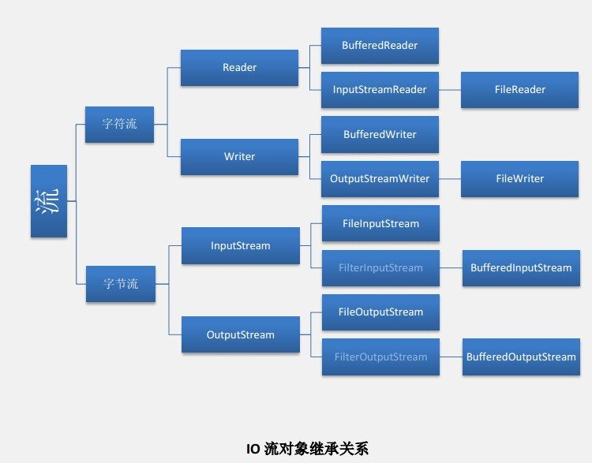

##IO流是干什么的？##

IO流指的是输入输出流，用来处理设备上的数据。这里的设备指硬盘，内存，键盘录入，网络传输等。

## IO流的分类？ ##

按处理数据类型来分：字节流和字符流  
按流的方向来分：输入流和输入流。

流的输入和输出是针对与当前应用来说的，如果读取其他应用或文件的数据到当前应用，则使用输入流读取；如果从当前应用**输出数据**，并写入到其他应用和文件，则使用输出流执行写入。

总之，当前应用需要读数据的时候，使用输入流；当前应用需要写数据的时候，使用输出流。简单来讲，**读入写出**，要读的话就用输入流，要写的话，就用输出流。

## 什么时候使用字节流？什么时候使用字符流？ ##

首先需要知道的是，任何数据存在硬盘上时，都是以二进制的形式存储的。而通过使用字节流，可以读取任意文件。字节流一次读取一个字节，而字符流使用了字节流读到一个或者多个字节时，去查找指定的编码表，返回对应的编码。所以字符流只能处理纯文本字符数据，而字节流可以处理更多类型的数据，比如图片，视频，音频文件等。因此，只要是纯文本数据处理，优先考虑使用字符流。其他情况就使用字节流。

## IO流类的关系 ##

## IO 包中的常见对象 ##

**1）字节流：**  

- 字节输入流  
> **FileInputStream(String name)**  
> Creates a FileInputStream by opening a connection to an actual file, the file named by the path name name in the file system.  
> **FileInputStream(File file)**  
> Creates a FileInputStream by opening a connection to an actual file, the file named by the File object file in the file system.  
> **BufferedInputStream(InputStream in)**  
> Creates a BufferedInputStream and saves its argument, the input stream in, for later use.  
> **BufferedInputStream(InputStream in, int size)**  
> Creates a BufferedInputStream with the specified buffer size, and saves its argument, the input stream in, for later use.  

- 字节输出流  
> **FileOutputStream(File file)**  
> Creates a file output stream to write to the file represented by the specified File object.  
> **FileOutputStream(String name)**  
> Creates a file output stream to write to the file with the specified name.  
> **BufferedOutputStream(OutputStream out)**  
> Creates a new buffered output stream to write data to the specified underlying output stream.  
> **BufferedOutputStream(OutputStream out, int size)**  
> Creates a new buffered output stream to write data to the specified underlying output stream with the specified buffer size.  

**2）字符流:**  

- 字符输入流  

> **FileReader(File file)**  
> Creates a new FileReader, given the File to read from.  
> **FileReader(String fileName)**  
> Creates a new FileReader, given the name of the file to read from.  
> **BufferedReader(Reader in)**  
> Creates a buffering character-input stream that uses a default-sized input buffer.  
> **BufferedReader(Reader in, int sz)**  
> Creates a buffering character-input stream that uses an input buffer of the specified size.  

- 字符输出流  

> **BufferedReader(Reader in)**  
> Creates a buffering character-input stream that uses a default-sized input buffer.  
> **BufferedReader(Reader in, int sz)**  
> Creates a buffering character-input stream that uses an input buffer of the specified size.  
> **BufferedWriter(Writer out)**  
> Creates a buffered character-output stream that uses a default-sized output buffer.  
> **BufferedWriter(Writer out, int sz)**  
> Creates a new buffered character-output stream that uses an output buffer of the given size.  
> 

**3）转换流:**  

> **InputStreamReader(InputStream in)**  
> Creates an InputStreamReader that uses the default charset.  
> **InputStreamReader(InputStream in, String charsetName)**  
> Creates an InputStreamReader that uses the named charset.
> **OutputStreamWriter(OutputStream out)**  
> Creates an OutputStreamWriter that uses the default character encoding.  
> **OutputStreamWriter(OutputStream out, String charsetName)**  
> Creates an OutputStreamWriter that uses the named charset.  

**4）文件对象:**  
> **File(File parent, String child)**  
> Creates a new File instance from a parent abstract pathname and a child pathname string.  
> **File(String pathname)**  
> Creates a new File instance by converting the given pathname string into an abstract pathname.  
> **File(String parent, String child)**  
> Creates a new File instance from a parent pathname string and a child pathname string.  

**5）打印流：**  

> **PrintWriter(File file)**  
> Creates a new PrintWriter, without automatic line flushing, with the specified file.  
> **PrintWriter(OutputStream out)**  
> Creates a new PrintWriter, without automatic line flushing, from an existing OutputStream.  
> **PrintStream(OutputStream out)**  
> Creates a new print stream.  
> **PrintStream(File file)**  
> Creates a new print stream, without automatic line flushing, with the specified file.  

## 字节流 ##

## 字符流 ##

## 转换流 ##
InputStreamReader:字节到字符的桥梁（将读取的字节流转换为字符流）；  
OutputStreamWriter:字符到字节的桥梁（将输入的字符流抓换为字节流）；

**构造函数**
> **InputStreamReader(InputStream in)**  
> 使用默认的编码表GBK创建一个InputStreamReader
> 
> **InputStreamReader(InputStream in, String charsetName)**  
> 指定编码表创建一个InputStreamReader
> 
> **OutputStreamWriter(OutputStream out)**  
> 使用默认的编码表GBK创建一个OutputStreamWriter
> 
> **OutputStreamWriter(OutputStream out, String charsetName)**  
> 指定编码表创建一个OutputStreamWriter

    public class OutputStreamWriterDemo {

		public static void main(String[] args){
			File file = new File("D:\\Test.java");
			try {
				// 写字符换转成字节流（使用GBK编码进行写）
				FileOutputStream outputStream = new FileOutputStream(file);
				OutputStreamWriter writer = new OutputStreamWriter(outputStream,"GBk");
				writer.write("我是中国人");
				writer.close();
				
				// 读取字节转换成字符（使用GBK编码进行读）
				FileInputStream inputStream = new FileInputStream(file);
				InputStreamReader reader = new InputStreamReader(inputStream,"GBk");
				StringBuffer buffer = new StringBuffer();
				char[] cbuf = new char[64];
				int count = 0;
				while((count = reader.read(cbuf))!=-1){
					buffer.append(cbuf,0,count);
					System.out.println(buffer);
				}
				reader.close();
	
			} catch (Exception e) {
				e.printStackTrace();
			} finally {
				
			}
			
		}
    }

## 参考： ##
[深入分析 Java 中的中文编码问题](http://www.ibm.com/developerworks/cn/java/j-lo-chinesecoding/)  
[IO流](http://www.cnblogs.com/thinksasa/archive/2012/10/26/2741091.html)
